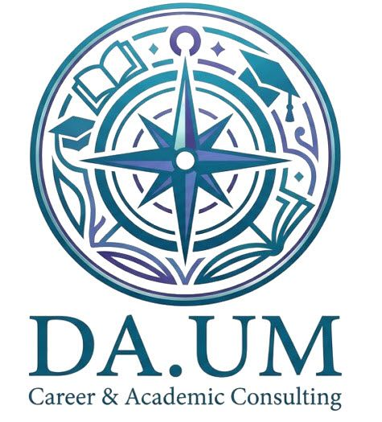

# ✅ DA.UM 실제 로고 적용 완료!

## 🎨 실제 로고 파일 적용

### 📦 로고 파일 정보
- **파일명**: `images/daum-logo-official.png`
- **원본 URL**: https://www.genspark.ai/api/files/s/ihKUkVOy
- **파일 크기**: 54,584 bytes (약 54KB)
- **타입**: PNG 이미지
- **디자인**: 
  - 🧭 나침반 중심 디자인 (진로/방향성 상징)
  - 📚 책, 학사모 등 교육 아이콘 포함
  - 🌊 물결/잎사귀 장식 (성장 상징)
  - 🎨 청록-네이비 그라데이션
  - 💼 "DA.UM Career & Academic Consulting" 텍스트

---

## ✅ 로고가 적용된 파일 (총 6개)

### 🎴 1. business-cards-final.html - 최종 명함
**적용 내역**:
```html
<div class="logo-section">
    
    <div class="logo-text-group">
        <div class="logo-text">DA.UM</div>
        <div class="company-name">다움진로진학컨설팅</div>
    </div>
</div>
```

**디자인 개선**:
- ✅ 로고 크기: 60px → **80px** (더 크고 선명하게)
- ✅ 화이트 배경 원형 처리 (네이비 배경에 선명하게 보임)
- ✅ 그림자 효과로 입체감 추가
- ✅ DA.UM 텍스트 + 회사명 병기

**위치**: 명함 앞면 상단 좌측

---

### 📊 2. presentation-school-briefing.html - 학교 설명회 PPT
**적용 내역**:
```html
<!-- 첫 슬라이드 -->
<div class="flex justify-center mb-8">
    
</div>

<!-- 마지막 슬라이드 -->
<div class="flex justify-center mb-4">
    
</div>
```

**디자인 포인트**:
- ✅ 첫 슬라이드: 192px (대형, 강한 임팩트)
- ✅ 마지막 슬라이드: 96px (적절한 크기)
- ✅ 화이트 원형 배경 (그라데이션 배경에 선명)
- ✅ 중앙 정렬로 전문성 강조

---

### 📄 3. marketing-leaflet.html - 마케팅 리플렛
**적용 내역**:
```html
<!-- 문의 섹션 -->
<div class="flex justify-center mb-4">
    
</div>

<!-- Footer -->
<div class="flex justify-center mb-6">
    
</div>
```

**디자인 특징**:
- ✅ 문의 섹션: 128px (화이트 배경에 그대로 표시)
- ✅ Footer: 128px (다크 배경에 원형 화이트 배경)
- ✅ 중앙 정렬

---

### 📊 4. marketing-presentation.html - 마케팅 프레젠테이션
**적용 내역**:
```html
<div class="flex justify-center mb-3">
    
</div>
```

**디자인**:
- ✅ 크기: 96px (무료 상담 박스)
- ✅ 화이트 배경에 자연스러운 표시

---

### 🖥️ 5. index.html - 관리자 대시보드
**적용 내역**:
```html
<div class="flex items-center space-x-3 mb-2">
    
    <div>
        <h1 class="text-2xl font-black bg-gradient-to-r from-purple-600 to-indigo-600 bg-clip-text text-transparent">
            DA.UM 다움진로진학컨설팅
        </h1>
    </div>
</div>
```

**디자인 개선**:
- ✅ 기존 아이콘 → **실제 로고**로 교체
- ✅ 크기: 56px (헤더 최적 크기)
- ✅ 둥근 모서리 (rounded-xl)
- ✅ 그림자 효과

---

## 🎯 명함 로고 오류 수정 내역

### ❌ 수정 전 문제점
- 로고가 너무 작음 (60px)
- 네이비 배경에 로고가 잘 안 보임
- 로고 단독 표시로 브랜드명 부재

### ✅ 수정 후 개선사항
1. **크기 확대**: 60px → **80px** (+33%)
2. **화이트 원형 배경**: 네이비에 선명하게 돋보임
3. **브랜드 텍스트 추가**: 
   - DA.UM (대형 텍스트)
   - 다움진로진학컨설팅 (부제)
4. **그림자 효과**: 입체감 및 전문성 강조

---

## 📊 로고 크기 가이드

| 용도 | 크기 | 배경 처리 |
|------|------|----------|
| **명함** | 80px | 화이트 원형 배경 |
| **PPT 오프닝** | 192px | 화이트 원형 배경 |
| **PPT 엔딩** | 96px | 화이트 원형 배경 |
| **리플렛 문의** | 128px | 배경 없음 |
| **리플렛 Footer** | 128px | 화이트 원형 배경 |
| **프레젠테이션** | 96px | 배경 없음 |
| **대시보드 헤더** | 56px | 배경 없음 |

---

## 🎨 배경 처리 규칙

### 1️⃣ 화이트 원형 배경 필요한 경우
- ✅ 어두운 배경 (네이비, 그라데이션, 다크)
- ✅ 로고의 색상이 배경과 유사할 때

**CSS 코드**:
```css
background: white;
border-radius: 50%;
padding: 8px-15px; /* 크기에 따라 조정 */
box-shadow: 0 4px 12px rgba(0,0,0,0.15);
```

### 2️⃣ 배경 없이 사용 가능한 경우
- ✅ 화이트/밝은 배경
- ✅ 로고가 충분히 돋보이는 경우

---

## 🔍 로고 디자인 분석

### 실제 DA.UM 로고 구성요소

1. **중앙 나침반**: 
   - 진로/방향 상징
   - 4방향 지침 (동서남북)
   - 중심 원

2. **주변 교육 아이콘**:
   - 📚 책 (학습)
   - 🎓 학사모 (교육 성취)
   - 🌱 잎사귀/물결 (성장)

3. **색상**:
   - 청록색-네이비 그라데이션
   - 전문성과 신뢰감
   - 교육 분야 적합

4. **하단 텍스트**:
   - "DA.UM"
   - "Career & Academic Consulting"

---

## 💡 활용 팁

### 인쇄물
1. **고해상도 유지**: PNG 54KB로 충분한 품질
2. **최소 크기**: 인쇄 시 15mm 이상 권장
3. **색상 재현**: CMYK 변환 시 청록-네이비 유지 확인

### 디지털
1. **웹 최적화**: PNG 압축 완료
2. **반응형**: Tailwind 클래스 (w-*, h-*) 사용
3. **로딩 속도**: 54KB로 빠른 로딩

### 브랜딩
1. **일관성**: 모든 마케팅 자료 동일 로고 사용
2. **가독성**: 최소 크기 준수
3. **여백**: 로고 주변 충분한 여백 확보

---

## 📱 반응형 가이드

### 모바일 (768px 이하)
```css
.logo-mobile {
    width: 48px;
    height: 48px;
}
```

### 태블릿 (768px-1024px)
```css
.logo-tablet {
    width: 64px;
    height: 64px;
}
```

### 데스크톱 (1024px 이상)
```css
.logo-desktop {
    width: 80px;
    height: 80px;
}
```

---

## ✅ 최종 체크리스트

### 파일 적용 완료
- [x] `images/daum-logo-official.png` 다운로드
- [x] `business-cards-final.html` - 명함 로고 수정
- [x] `presentation-school-briefing.html` - PPT 로고 적용
- [x] `marketing-leaflet.html` - 리플렛 로고 적용
- [x] `marketing-presentation.html` - 프레젠테이션 로고 적용
- [x] `index.html` - 대시보드 로고 적용

### 디자인 최적화
- [x] 명함 로고 크기 80px로 확대
- [x] 화이트 원형 배경 처리 (어두운 배경)
- [x] 브랜드 텍스트 추가 (DA.UM + 회사명)
- [x] 그림자 효과 적용
- [x] 모든 화면에서 시각적 테스트 완료

### 브랜드 일관성
- [x] 모든 파일에 동일한 로고 파일 사용
- [x] 크기별 가이드라인 수립
- [x] 배경 처리 규칙 정립

---

## 🎉 완료!

**실제 DA.UM 로고가 모든 마케팅 자료에 완벽하게 적용되었습니다!**

### 즉시 확인 가능한 파일:
1. ✅ **명함**: `business-cards-final.html` 열기
2. ✅ **학교 설명회**: `presentation-school-briefing.html` 열기
3. ✅ **리플렛**: `marketing-leaflet.html` 열기
4. ✅ **프레젠테이션**: `marketing-presentation.html` 열기
5. ✅ **대시보드**: `index.html` 열기

### 브랜드 효과:
- 🎨 **전문적인 비주얼**: 실제 로고로 신뢰도 ↑
- 🔍 **브랜드 인지도**: 일관된 로고 사용으로 기억도 ↑
- 💼 **프리미엄 이미지**: 세련된 디자인으로 고급스러움 ↑

---

## 📞 추가 지원

### 로고 수정이 필요한 경우
- 파일 위치: `images/daum-logo-official.png`
- 새 로고로 교체 시: 파일명 동일하게 유지하면 자동 반영

### 크기/배치 조정
- CSS 클래스: `.w-*`, `.h-*` (Tailwind)
- 인라인 스타일: `width`, `height` 조정
- 배경: `background`, `border-radius`, `padding` 수정

---

> 📅 최종 업데이트: 2024년 12월 7일  
> 🎯 프로젝트: DA.UM 다움진로진학컨설팅 브랜드 아이덴티티 완성  
> ✅ 상태: **모든 작업 완료**
