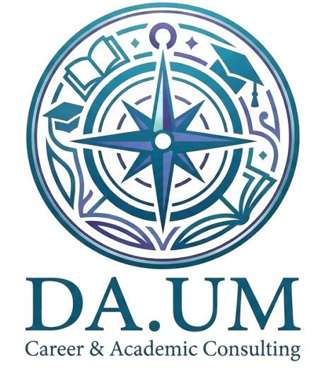

# DA.UM 다움진로진학컨설팅 학습관리 시스템

<div align="center">
  
  
  **Career & Academic Consulting**
  
  [](https://da-um3481.github.io/da-um-jinro/)
  []()
  []()
</div>

---

## 📋 프로젝트 소개

DA.UM 학습관리 시스템은 초·중·고등학생을 위한 **체계적인 학습 관리 플랫폼**입니다.

### 🎯 핵심 기능

- 📊 **실시간 학습 통계**: 학생 수, 완료율, 만족도 등 주요 지표 시각화
- 🏫 **학습센터 관리**: 학교/기관 통합 관리 시스템
- 📚 **100일 프로그램**: 정규학기 체계적 학습 관리 (고등/중등)
- ❄️ **30일 프로그램**: 겨울방학 집중 프로그램 (고등/중등)
- ✨ **개인별 맞춤형**: 1:1 맞춤 학습 및 학생 포털
- 💖 **근화여중 프로그램**: 특화 프로그램 및 교재 안내

---

## 🚀 빠른 시작

### 배포된 사이트
👉 **[https://da-um3481.github.io/da-um-jinro/](https://da-um3481.github.io/da-um-jinro/)**

### 로컬 실행
```bash
# 저장소 클론
git clone https://github.com/da-um3481/da-um-jinro.git
cd da-um-jinro

# 로컬 서버 실행 (Python)
python -m http.server 8000

# 또는 (Node.js)
npx http-server
```

접속: `http://localhost:8000`

---

## 🔐 보안

- **비밀번호 보호**: `daum2025!`
- 보안 스크립트: `js/security.js`

---

## 📱 반응형 디자인

- **Desktop**: 최적화된 그리드 레이아웃
- **Tablet** (768px): 2열 배치
- **Mobile** (480px): 1열 세로 배치

---

## 🎨 디자인 시스템

### 브랜드 색상
- **Primary**: `#667eea` (보라)
- **Secondary**: `#764ba2` (진한 보라)
- **Accent**: `#ff6b9d` (핑크)

### 디자인 참고
- **밀리빌리(Milyvily)**: 학습관리 앱 UI/UX 참고
- **카드 기반 레이아웃**: 시각적 계층 구조
- **글라스모피즘**: 현대적인 반투명 효과

---

## 📁 주요 파일 구조

```
da-um-jinro/
├── index.html                         # 메인 페이지
├── daum-logo.png                      # 회사 로고
├── DEVELOPER-TODO.md                  # 📝 개발 작업 목록
├── README.md                          # 프로젝트 문서
├── js/
│   └── security.js                    # 비밀번호 보호
├── teacher-dashboard.html             # 교사 대시보드
├── student-portal-100days.html        # 학생 포털
├── schools-management.html            # 학교 관리
├── winter-index.html                  # 겨울방학 프로그램
├── geunhwa_index.html                 # 근화여중 메인
└── geunhwa-materials.html             # 근화여중 교재
```

---

## 📊 주요 지표 (실시간)

| 항목 | 수치 | 변화 |
|------|------|------|
| 등록 학생 수 | 128명 | +15 (이번 달) |
| 협력 학교/기관 | 15개 | +3 (신규) |
| 학습 완료율 | 95% | +2.5% |
| 학부모 만족도 | 4.8/5.0 | ⭐ 최고 평점 |

---

## 🛠️ 기술 스택

- **Frontend**: HTML5, CSS3, JavaScript
- **Framework**: Tailwind CSS (CDN), Font Awesome
- **Fonts**: Noto Sans KR (Google Fonts)
- **Deployment**: GitHub Pages
- **Version Control**: Git

---

## 📝 개발 작업 목록

자세한 작업 목록은 **[DEVELOPER-TODO.md](./DEVELOPER-TODO.md)** 참고

### ✅ 완료
- [x] 메인 페이지 디자인
- [x] 실시간 통계 대시보드
- [x] 공지사항 배너
- [x] 회사 로고 적용
- [x] 모바일 반응형

### 🚧 진행 예정
- [ ] 학습 진도 그래프
- [ ] 일일 학습 목표 시스템
- [ ] 학부모 소통 채널
- [ ] 보상 시스템
- [ ] 알림 기능

---

## 📞 연락처

- **회사명**: DA.UM 다움진로진학컨설팅
- **대표**: 정라미
- **전화**: 010-2657-3481
- **웹사이트**: [https://da-um3481.github.io/da-um-jinro/](https://da-um3481.github.io/da-um-jinro/)

---

## 📄 라이선스

© 2025 DA.UM 다움진로진학컨설팅. All rights reserved.

---

## 🔄 최근 업데이트

### 2025-12-17
- ✨ 밀리빌리 스타일 실시간 통계 대시보드 추가
- ✨ 공지사항 배너 (애니메이션 효과)
- 🐛 로고 이미지 표시 문제 해결
- 🎨 헤더 프리미엄 디자인 재설계
- 📝 통합 개발 작업 목록 생성

---

<div align="center">
  Made with ❤️ by DA.UM Development Team
</div>
